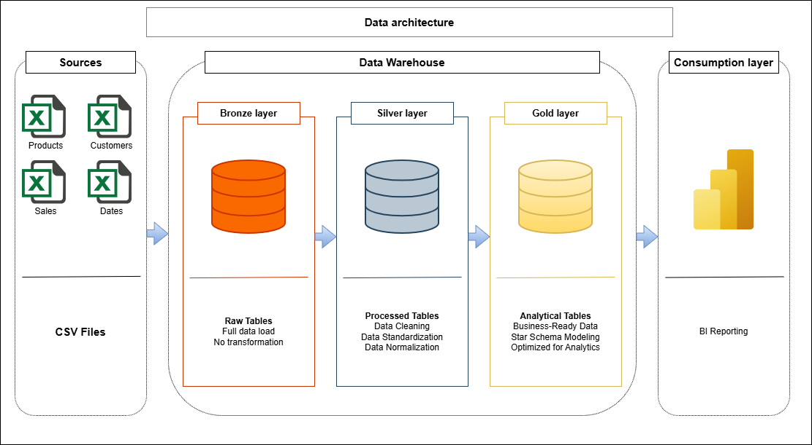

# Retail Data Warehouse Project

Welcome to my Data Warehouse and Data Analytics project.

This project tries to simulate the workflow of a data professional responsible for designing and implementing a centralized analytical database for a retail company.

---

# Project Overview

The business requirements were generated with the support of **ChatGPT** to emulate stakeholder and management requests, while the fictional datasets were generated using **Fabricate.Tonic.AI**.

The project includes:

1. Building a Data Warehouse using Medallion Architecture (Bronze, Silver, and Gold layers)
2. Developing ETL pipelines to extract, transform, and load data from CSV source files into the warehouse
3. Creating analytical reports and dashboards to generate business insights and support decision-making

---

# Business Context

The company is a medium-sized retail business operating through both physical stores and online sales channels.

The business aims to improve:

- Sales performance
- Customer understanding
- Product strategy
- Operational decision-making

Currently, the leadership team relies on fragmented spreadsheets and operational systems, creating difficulties in obtaining reliable analytical insights.

The goal of this project is to design a centralized analytical database optimized for Business Intelligence and reporting.

---

# Business Requirements

The database must allow the company to:

1. Analyze sales performance over time
2. Understand customer behavior
3. Track product performance
4. Monitor revenue trends
5. Support strategic decision-making using reliable data

---

## Data architecture

The data architecture for this project follows Medallion Architecture **Bronze**, **Silver**, and **Gold** layers:

1. **Bronze Layer**: Stores raw data from the csv source.
2. **Silver Layer**: This layer includes data cleansing, standardization, and normalization processes to prepare data for analysis.
3. **Gold Layer**: Business-ready data modeled into a star schema required for reporting and analytics.
