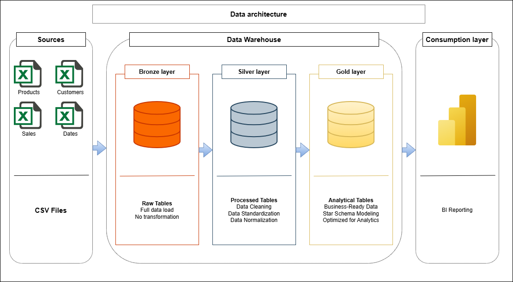

# Retail Data Warehouse Project

Welcome to my Data Warehouse and Data Analytics project.

This project tries to simulate the workflow of a data professional responsible for designing and implementing a centralized analytical database for a retail company.

---

# Project Overview

The business requirements were generated with the support of **ChatGPT** to emulate stakeholder and management requests, while the fictional datasets were generated using **Fabricate.Tonic.AI**.

The project includes:

- Building a Data Warehouse using Medallion Architecture (Bronze, Silver, and Gold layers)
- Developing ETL pipelines to extract, transform, and load data from CSV source files into the warehouse
- Creating analytical reports and dashboards to generate business insights and support decision-making

---

# Business Context

The company is a medium-sized retail business operating through both physical stores and online sales channels.

The business aims to improve:

- Sales performance
- Customer understanding
- Product strategy
- Operational decision-making

Currently, the leadership team relies on fragmented spreadsheets and operational systems, creating difficulties in obtaining reliable analytical insights.

The goal of this project is to design a centralized analytical database optimized for Business Intelligence and reporting.

---

## Data architecture

The data architecture for this project follows the Medallion Architecture approach, organized into Bronze, Silver, and Gold layers.

- **Bronze Layer**: Stores raw data from the csv source.
- **Silver Layer**: This layer applies data cleaning, normalization, and transformation processes to prepare the data for analytical usage.
- **Gold Layer**: Contains business-ready data modeled into a Star Schema optimized for reporting, dashboarding, and analytics.
